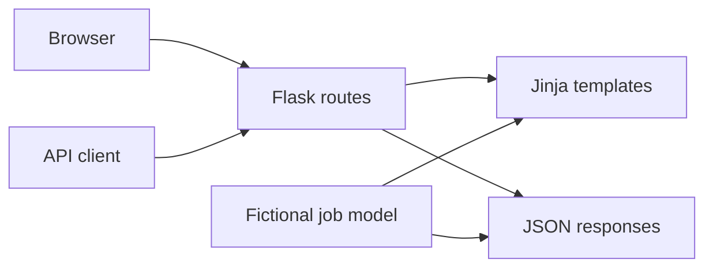

# TalentFlow — Flask Careers Portal

**A recruiter-facing careers portal that demonstrates end-to-end Python web
development with Flask, Jinja, a filterable JSON API, automated tests, and
container-ready deployment.**

[](pyproject.toml)
[](https://flask.palletsprojects.com/)
[](tests)
[](LICENSE)

TalentFlow turns an early Flask experiment into a small, complete recruiting
product. The same fictional job model powers a polished server-rendered UI
and REST-style API endpoints, with explicit privacy boundaries and no
applicant-data collection.

## What I built

| Area | Implementation |
|---|---|
| Backend | Flask app factory, typed route handlers, environment-based runtime configuration |
| Frontend | Responsive semantic HTML, custom CSS design system, reusable Jinja components |
| API | Job collection/detail endpoints with keyword, department, and location filtering |
| Reliability | Pytest coverage for pages, filters, 404 behavior, and health checks |
| Deployment | Gunicorn process configuration, non-root Docker image, GitHub Actions test workflow |
| Privacy | Fictional listings only; no forms, resumes, applicant records, secrets, or analytics |

## Architecture



The project deliberately uses an in-memory data model to keep the portfolio
example focused. A production version would move jobs into a database and add
authentication, authorization, an applicant workflow, and an admin surface.

## API

| Method | Endpoint | Purpose |
|---|---|---|
| `GET` | `/` | Render the careers experience |
| `GET` | `/api/jobs` | Return all jobs |
| `GET` | `/api/jobs?q=python` | Search titles, teams, descriptions, locations, and skills |
| `GET` | `/api/jobs?department=Engineering` | Filter by an exact department |
| `GET` | `/api/jobs?location=remote` | Filter by a partial location match |
| `GET` | `/api/jobs/<id>` | Return one job or a `404` |
| `GET` | `/health` | Deployment health check |

Example response:

```json
{
  "count": 1,
  "jobs": [
    {
      "id": 1,
      "title": "Machine Learning Platform Engineer",
      "department": "Engineering",
      "location": "San Francisco, CA · Hybrid",
      "skills": ["Python", "PyTorch", "Kubernetes"]
    }
  ]
}
```

## Run locally

```bash
git clone https://github.com/quantumdotsss/flask-careers-portal.git
cd flask-careers-portal
python -m venv .venv
source .venv/bin/activate
python -m pip install -r requirements.txt
python app.py
```

Open `http://127.0.0.1:5000`.

## Test

```bash
python -m pip install -r requirements-dev.txt
python -m pytest -q
```

## Container

```bash
docker build -t talentflow-careers .
docker run --rm -p 8000:8000 talentflow-careers
```

Then open `http://127.0.0.1:8000` or call `/health`.

## Project evolution

The original version established the core Flask concepts: routing, dynamic
Jinja rendering, reusable template fragments, and a JSON endpoint. This
iteration keeps that foundation and adds:

- professional information architecture and responsive visual design;
- a reusable Flask application factory;
- API search and filtering;
- detail and health endpoints;
- automated request-level tests;
- production-oriented Gunicorn and Docker configuration;
- clear fictional-data and privacy boundaries.

## Limitations and next steps

- Listings are in memory and reset whenever the process restarts.
- The project does not collect applications or personal information.
- Authentication, database migrations, rate limiting, observability, and an
  admin dashboard would be required for production use.

## License

MIT. See [LICENSE](LICENSE).
